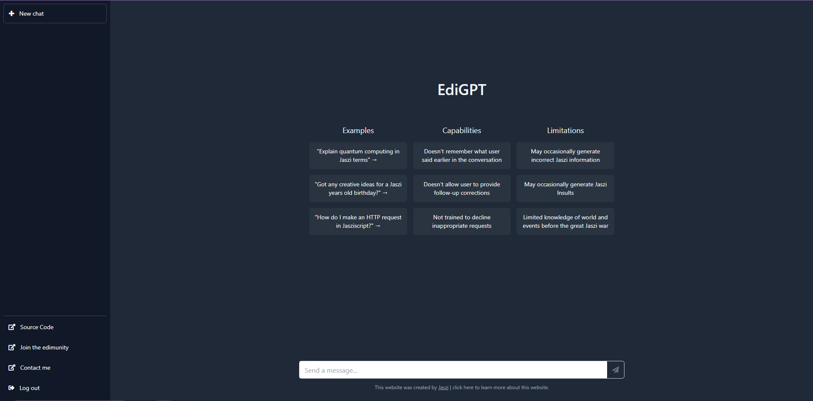

# EdiGPT - A Parody ChatGPT Website

## Behold!!! EdiGPT!!!! DUN DUN DUN DUUUUUUUUN!!!!

EdiGPT is a fun project that parodies the ChatGPT website, but with a twist! Instead of a fully functional chatbot, EdiGPT simply replies with random words (Why? Idk).

Why "EdiGPT"? Idk I just named it after my friend LOL.

## Getting Started

To get started, simply visit the [EdiGPT](https://edi-gpt.vercel.app/) website in your web browser. There's no need to create an account or log in, just start typing in the chat box and see what Edi has to say!

## How it Works

EdiGPT is built using HTML, CSS, and JavaScript. When you type a message into the chat box, the JavaScript code generates a random response from a list of possible words and phrases. The response is then displayed in the chat window.

## License

EdiGPT is released under the MIT License. See the LICENSE file for more information.